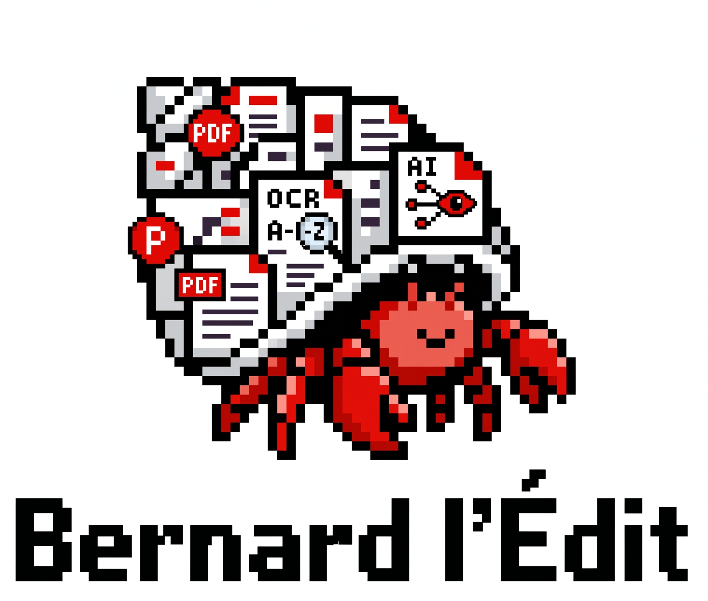

# Bernard l'Édit

  

PDF, image, and geometry utilities for the Mindee ecosystem.

A Rust library providing a shared, high-performance foundation for PDF manipulation, image processing, and geometry operations.

It is used internally by the official Mindee Client Libraries.

## Status

Under *heavy* development. Expect things to break.

## License

Apache 2.0 — see [LICENSE](LICENSE).
